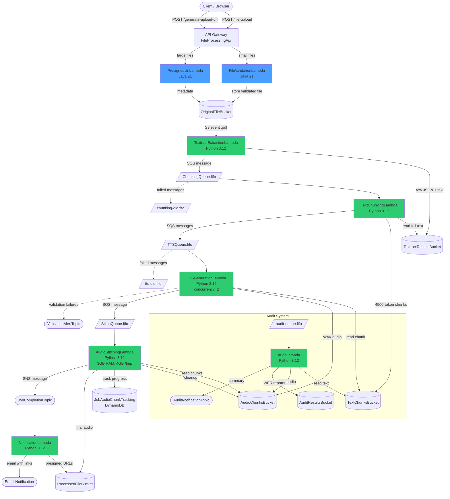

# Architecture

## Processing Pipeline

**Legend**: Blue = Java Lambda, Green = Python Lambda

## Resource Inventory

### S3 Buckets

| Bucket | Purpose | Lifecycle |
|--------|---------|-----------|
| `original-file-bucket` | Uploaded PDF/TXT/EPUB files | None |
| `textract-results-bucket` | Raw Textract JSON + extracted text | 30 days |
| `text-chunks-bucket` | 4500-token text chunks | 7 days (auto-delete) |
| `audio-chunks-bucket` | Individual WAV audio chunks | 7 days |
| `processed-file-bucket` | Final stitched audio files | None |
| `audit-results-bucket` | WER reports and transcriptions | 90 days |

### Lambda Functions

| Lambda | Runtime | Trigger | Memory | Timeout | Concurrency |
|--------|---------|---------|--------|---------|-------------|
| FileValidationLambda | Java 21 | API Gateway POST | 1024 MB | 15 min | Default |
| PresignedUrlLambda | Java 21 | API Gateway POST | 512 MB | 30 sec | Default |
| TextractExtractionLambda | Python 3.12 | S3 event (.pdf) | 2048 MB | 15 min | Default |
| TextChunkingLambda | Python 3.12 | SQS (ChunkingQueue) | 1024 MB | 2 min | Default |
| TTSGenerationLambda | Python 3.12 | SQS (TTSQueue) | 2048 MB | 15 min | 2 |
| AudioStitchingLambda | Python 3.12 | SQS (StitchQueue) | 3008 MB | 10 min | 5 |
| NotificationLambda | Python 3.12 | SNS (JobCompletion) | 256 MB | 1 min | Default |
| AuditLambda | Python 3.12 | SQS (AuditQueue) | 1024 MB | 15 min | Default |

### SQS Queues

| Queue | Type | Visibility Timeout | DLQ | Purpose |
|-------|------|-------------------|-----|---------|
| `chunking-queue.fifo` | FIFO | 5 min | chunking-dlq | Text chunking jobs |
| `chunking-dlq.fifo` | FIFO | - | - | Failed chunking jobs |
| `tts-processing-queue.fifo` | FIFO | 16 min | tts-dlq | TTS generation jobs |
| `tts-dlq.fifo` | FIFO | - | - | Failed TTS jobs |
| `stitch-notification-queue.fifo` | FIFO | 11 min | - | Audio stitching triggers |
| `audit-queue.fifo` | FIFO | 16 min | - | Audit requests |

### SNS Topics

| Topic | Purpose | Subscribers |
|-------|---------|-------------|
| `tts-validation-alerts` | Audio validation failures after retries | Email |
| `tts-job-complete` | Job completion notifications | NotificationLambda + Email |
| `tts-audit-complete` | Audit result summaries | Email |

### DynamoDB Tables

| Table | Partition Key | Billing | TTL | Purpose |
|-------|--------------|---------|-----|---------|
| `JobAudioChunkTracking` | `job_id` (String) | On-demand | Yes | Track chunk completion per job |

### API Gateway

| API | Endpoint | Method | Handler |
|-----|----------|--------|---------|
| FileProcessingApi | `/file-upload` | POST | FileValidationLambda |
| FileProcessingApi | `/generate-upload-url` | POST | PresignedUrlLambda |
