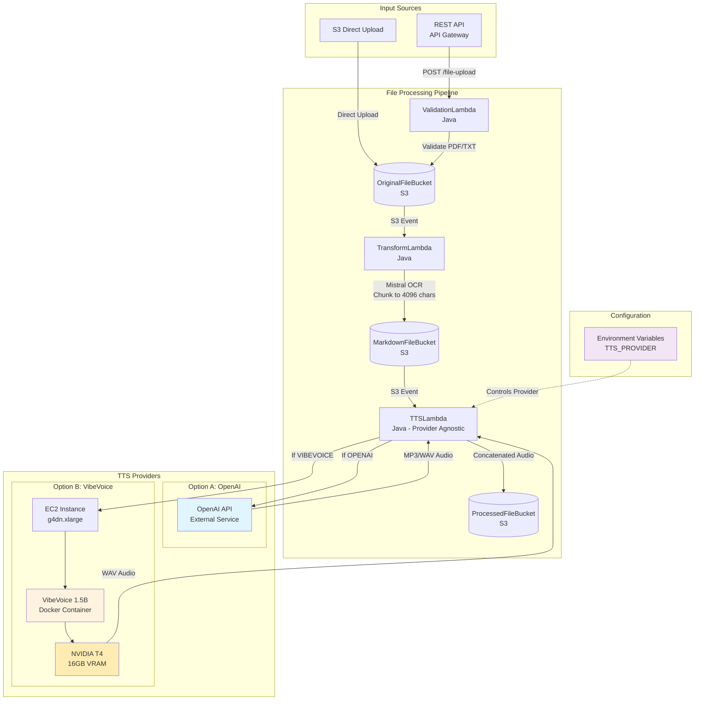
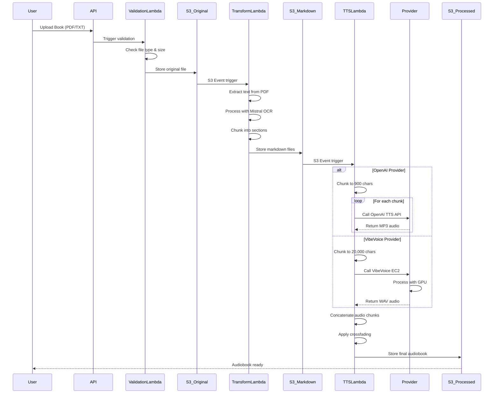
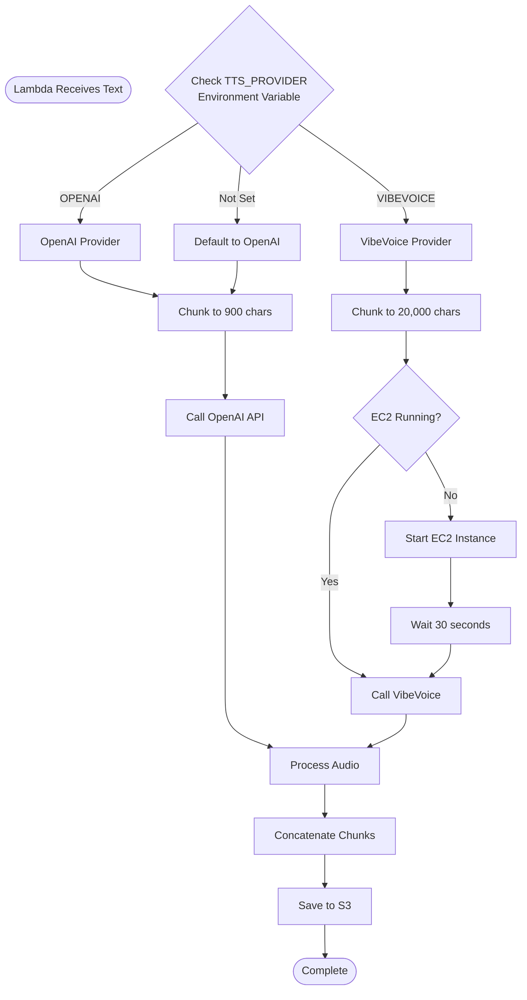
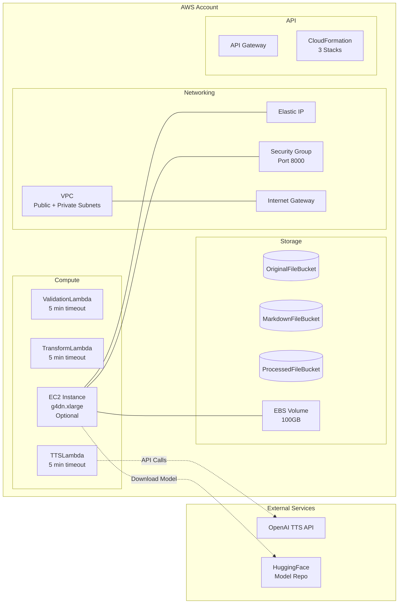
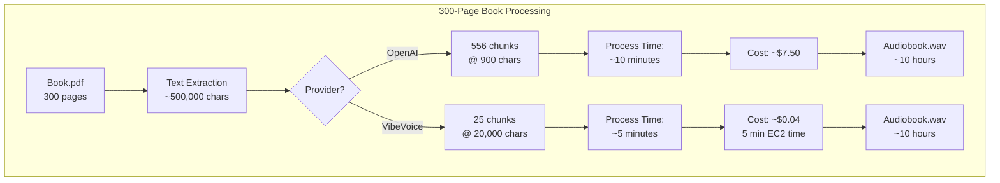
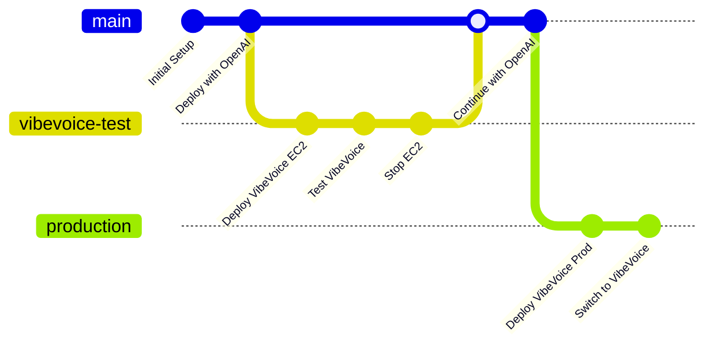
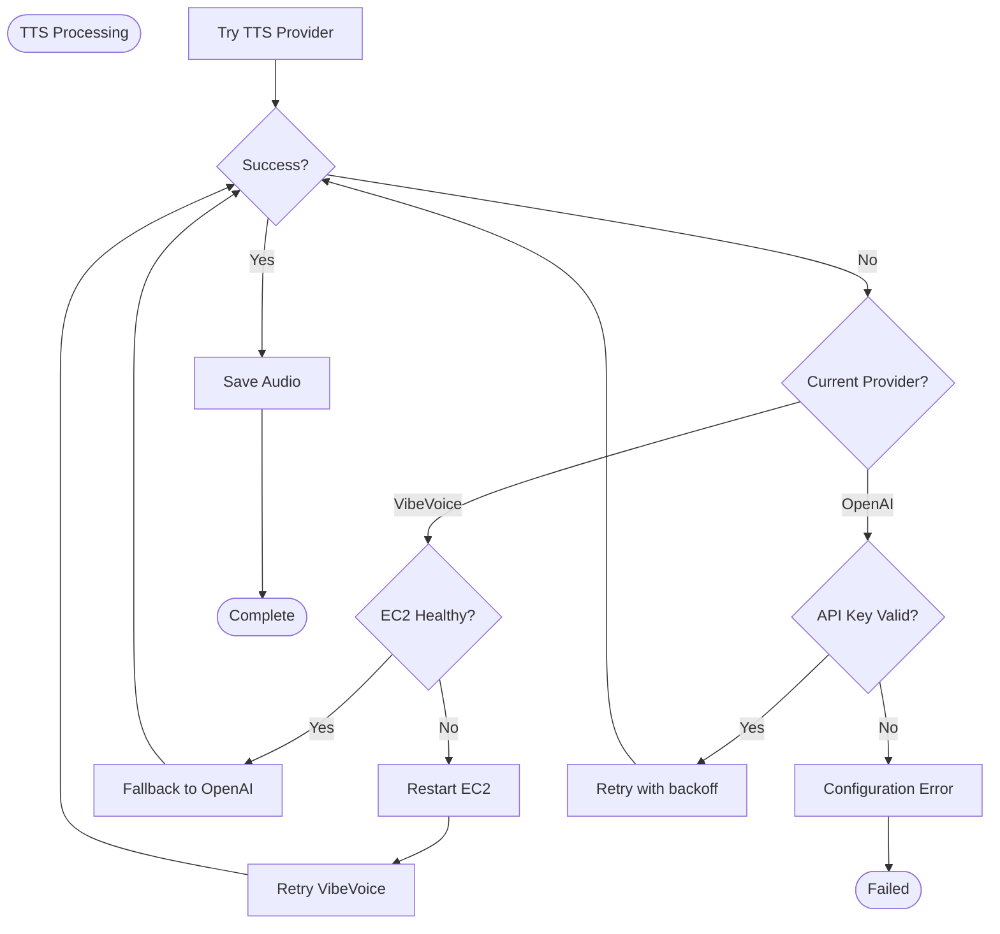
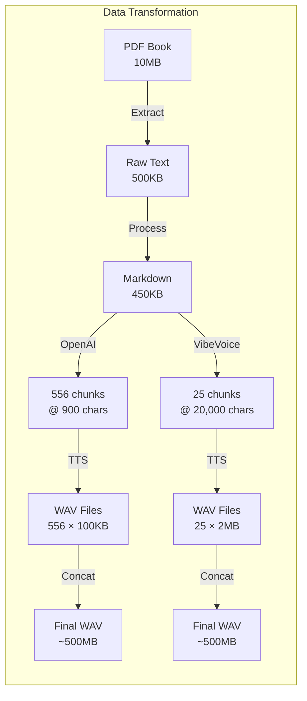
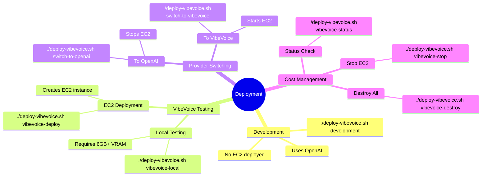

# TTS Microservice Architecture & Flow

## Complete System Overview



## Detailed Book Processing Flow



## Provider Selection Logic



## Infrastructure Components



## Cost Optimization Flow

```mermaid
stateDiagram-v2
    [*] --> Deployed: Deploy Infrastructure

    Deployed --> OpenAI_Mode: Default State

    OpenAI_Mode --> EC2_Stopped: EC2 Exists but Stopped
    note right of EC2_Stopped: Cost: $8/month<br/>(EBS storage only)

    EC2_Stopped --> EC2_Running: switch-to-vibevoice
    note right of EC2_Running: Cost: $0.526/hour<br/>($378/month if 24/7)

    EC2_Running --> EC2_Stopped: switch-to-openai

    EC2_Running --> Processing: Process Books
    Processing --> EC2_Running: Continue

    EC2_Stopped --> Destroyed: vibevoice-destroy
    note right of Destroyed: Cost: $0

    Destroyed --> [*]
```

## Book Processing Example



## Development Workflow



## Error Handling Flow



## Data Flow Sizes



## Deployment Commands Map



## Summary

This architecture provides:
- 📚 **Scalable book processing** from PDF/TXT to audiobook
- 🔄 **Provider flexibility** between OpenAI and VibeVoice
- 💰 **Cost optimization** with start/stop EC2 capability
- 🚀 **Performance options** based on requirements
- 🛡️ **Safe defaults** preventing accidental charges

The system automatically handles the complete flow from book upload to audiobook generation, with provider selection controlled by simple environment variables.